# Trabalho Prático: Analisador Léxico (Scanner) — Documentação

**Grupo**: Mayssa Barbosa Dias; Larissa Queiroz Ramos; Fernando Medeiros; Matheus Augusto  
**Curso**: 7º semestre CC — Turma "A"

## 5.1 Título
Trabalho Prático: Analisador Léxico (Scanner) para a Linguagem Java-- (Compiladores)

## 5.2 Visão Geral
O objetivo deste trabalho é desenvolver um analisador léxico (scanner) capaz de ler um arquivo de entrada contendo código da linguagem Java-- e reconhecer tokens válidos (palavras reservadas, identificadores, números e símbolos). Para cada lexema reconhecido, o scanner imprime na saída a informação de linha, coluna, tipo do token e valor (lexema). Quando um padrão inválido é identificado (por exemplo, formas incorretas de números reais ou prefixo incorreto em hexadecimal), o scanner imprime uma mensagem de erro léxico com linha e coluna.

### Módulos e interdependências
O scanner é implementado em três partes principais:

1. `Scanner.flex`
   - Define macros (como `DIGIT`, `LETTER`, `IDENT`, `FLOAT`, `HEX`, etc.).
   - Define expressões regulares para tokens válidos.
   - Define regras para tokens inválidos (erros léxicos) e para comentários de múltiplas linhas via estado dedicado.
   - Define ações associadas, que chamam `printToken` e `printError`.

2. `Scanner.java` (gerado pelo JFlex)
   - Implementa o motor do scanner (DFA gerado pelo JFlex) e o suporte à contagem de `line` e `column`.
   - Inclui o método `main` para executar o scanner como programa standalone.
   - Inclui a implementação dos métodos auxiliares:
     - `printToken(String tipo, String valor)`
     - `printError(String mensagem)`

3. Arquivo de entrada de teste (ex.: `entrada.txt`)
   - Serve como massa de teste contendo exemplos válidos e inválidos, inclusive comentários em bloco.

### Diagrama (visão de inter-relações)
```mermaid
flowchart LR
  A[Scanner.flex\n(modos, expressões regulares, ações)] --> B[Scanner.java\n(autômato gerado + main)]
  B --> C[Leitura do arquivo de entrada]
  C --> D[Saída tokens/erros\nformato: [linha,coluna] tipo: valor]
```

## 5.3 Tokens e Expressões Regulares

### Observação sobre prioridade (tokens vs identificadores)
As palavras reservadas são reconhecidas por regras específicas (por exemplo, `program`, `if`, `while`, etc.) antes de `IDENT`. Assim, quando um lexema corresponde a uma palavra reservada, ele é retornado como `KEYWORD` e não como `IDENT`.

### 5.3.1 Tabela de Tokens Válidos
A tabela a seguir lista os tokens reconhecidos pelo scanner com seus lexemas, expressões regulares e atributos (valor impresso).

> Atributo: neste scanner, o atributo usado na saída é o próprio lexema reconhecido, pois `printToken(tipo, yytext())` imprime a string do token.

| Tipo (token) | Lexemas (exemplos) | Expressão regular (conforme `Scanner.flex`) | Atributos |
|---|---|---|---|
| `KEYWORD` | `program`, `final`, `class`, `void`, `if`, `else`, `while`, `return`, `read`, `print`, `new` | literais: `"program"`, `"final"`, `"class"`, `"void"`, `"if"`, `"else"`, `"while"`, `"return"`, `"read"`, `"print"`, `"new"` | `yytext()` (lexema exato) |
| `RELOP` | `==`, `!=`, `>=`, `<=`, `>`, `<` | `"=="` \| `"!="` \| `">="` \| `"<="` \| `">"` \| `"<"` | `yytext()` |
| `ASSIGN` | `=` | `"="` | `yytext()` |
| `ADDOP` | `+`, `-` | `"+"` \| `"-"` | `yytext()` |
| `MULOP` | `*`, `/`, `%` | `"*"` \| `"/"` \| `"%"` | `yytext()` |
| `SEMICOLON` | `;` | `";"` | `yytext()` |
| `COMMA` | `,` | `","` | `yytext()` |
| `DOT` | `.` | `"."` | `yytext()` |
| `LPAREN` | `(` | `"("` | `yytext()` |
| `RPAREN` | `)` | `")"` | `yytext()` |
| `LBRACE` | `{` | `"{"` | `yytext()` |
| `RBRACE` | `}` | `"}"` | `yytext()` |
| `LBRACKET` | `[` | `"["` | `yytext()` |
| `RBRACKET` | `]` | `"]"` | `yytext()` |
| `FLOAT` | `3.14`, `12.5`, `100.0` | `DIGIT+"."DIGIT+` onde `DIGIT = [0-9]` | `yytext()` |
| `INT_HEX` | `0xFF`, `0x1a3f` (prefixo `0x` minúsculo) | `HEX = 0x[0-9a-fA-F]+` | `yytext()` |
| `INT` | `0`, `10`, `255` | `INT = DIGIT+` | `yytext()` |
| `CHAR_CONST` | `'a'`, `'\n'`, `'\"'` etc. | `CHAR_CONST = \'([^\\'\n\r]|\\[btnr'\"\\])\'` | `yytext()` |
| `IDENT` | `Demo`, `limite`, `x`, `media`, `letra` | `IDENT = ID_START ID_PART*` onde `ID_START = (LETTER|_)` e `ID_PART=(LETTER|DIGIT|_)`; `LETTER=[a-zA-Z]`, `DIGIT=[0-9]` | `yytext()` |

### Macros utilizadas (resumo)
- `DIGIT = [0-9]`
- `LETTER = [a-zA-Z]`
- `ID_START = (LETTER|_)`
- `ID_PART = (LETTER|DIGIT|_)`
- `IDENT = ID_START ID_PART*`
- `INT = DIGIT+`
- `FLOAT = DIGIT+"."DIGIT+`
- `HEX = 0x[0-9a-fA-F]+`
- `CHAR_CONST = \'([^\\'\n\r]|\\[btnr'\"\\])\'`
- `WS = [ \t\f]+` (ignorado)
- `NEWLINE = \r\n|\r|\n` (ignorado)

### 5.3.2 Palavras Reservadas
As palavras reservadas da linguagem Java-- (conforme implementado no scanner) são:

| Palavra reservada | Token retornado |
|---|---|
| `program` | `KEYWORD` |
| `final` | `KEYWORD` |
| `class` | `KEYWORD` |
| `void` | `KEYWORD` |
| `if` | `KEYWORD` |
| `else` | `KEYWORD` |
| `while` | `KEYWORD` |
| `return` | `KEYWORD` |
| `read` | `KEYWORD` |
| `print` | `KEYWORD` |
| `new` | `KEYWORD` |

### 5.3.3 Autômato Finito Determinista (AFD)
Foi projetado um AFD conceitual (compatível com as expressões regulares usadas no `Scanner.flex`) com o objetivo de reconhecer as categorias léxicas implementadas.

Categorias reconhecidas pelo AFD:
- IDENT: sequência iniciando com letra ou `_`, seguida de zero ou mais letras/dígitos/`_`
- INT: sequência de um ou mais dígitos
- FLOAT: INT + `.` + pelo menos um dígito após o ponto
- INT_HEX: prefixo `0x` (minúsculo) + pelo menos um dígito hexadecimal
- CHAR_CONST: constante entre aspas simples com suporte a escapes permitidos
- Símbolos e operadores: tokens de tamanho 1 e alguns de tamanho 2 (ex.: `==`, `!=`, `>=`, `<=`)
- Comentários de múltiplas linhas: `/* ... */` usando um estado dedicado
- Whitespace: ignorado

#### Diagrama (estados principais)

```mermaid
stateDiagram-v2
  [*] --> S0

  %% IDENT
  S0 --> SID : (LETTER ou "_")
  SID --> SID : (LETTER ou DIGIT ou "_")
  SID --> S0 : outro caractere (encerra IDENT)

  %% Números: INT / FLOAT / HEX
  S0 --> SINT : DIGIT
  SINT --> SINT : DIGIT
  SINT --> SFLOAT_DOT : "."
  SFLOAT_DOT --> SFLOAT : DIGIT
  SFLOAT --> SFLOAT : DIGIT
  SFLOAT --> S0 : outro caractere (encerra FLOAT)

  %% HEX: reconhece "0x" (0 seguido de x)
  S0 --> S0X : "0"
  S0X --> SHEX_PREFIX : "x"
  SHEX_PREFIX --> SHEX : HEX_DIGIT
  SHEX --> SHEX : HEX_DIGIT
  SHEX --> S0 : outro caractere (encerra INT_HEX)

  %% CHAR_CONST
  S0 --> SCHAR : "'"
  SCHAR --> SCHAR_ESC : "\\"
  SCHAR --> SCHAR_END : (caractere normal permitido)
  SCHAR_ESC --> SCHAR_END : (b|t|n|r|'|"|\\)
  SCHAR_END --> S0 : "'"

  %% Comentários: "/* ... */"
  S0 --> SCOMMENT : "/" seguido de "*"
  SCOMMENT --> SCOMMENT : caractere qualquer (exceto início de "*/" ou "/*")
  SCOMMENT --> S0 : "*/" (fim do comentário)
  SCOMMENT --> SCOMMENT : "/*" (erro: comentário aninhado não permitido)

  %% Operadores e delimitadores
  S0 --> S0 : tokens de 1 caractere (+,-,*,/,%,;,<,>,= etc conforme regra)
  S0 --> S0 : tokens de 2 chars reconhecidos por lookahead (=,!,>,<)
```


#### Resumo determinístico de transições (visão prática)
- No estado inicial `S0`:
  - Se o próximo caractere for letra ou `_`, entra em `SID` e consome letras/dígitos/`_` até que termine o lexema.
  - Se o próximo caractere for dígito, entra em `SINT`.
    - Se aparecer `.` após uma sequência de dígitos, passa para o reconhecimento de `FLOAT` exigindo pelo menos um dígito após o ponto.
    - Se for o caso especial do prefixo `0x` (prefixo minúsculo), o AFD identifica `INT_HEX` e consome dígitos hexadecimais.
  - Se o próximo caractere for `'`, entra em `SCHAR` para reconhecer `CHAR_CONST`.
    - Se houver `\\`, aceita apenas escapes permitidos e exige o `'` final.
  - Se o próximo caractere for `/`, verifica lookahead:
    - `/*` => entra no estado `SCOMMENT` até encontrar `*/`.
    - caso contrário => token `MULOP` com lexema `/`.
  - Se for um dos operadores/pontuações de 1 caractere, o AFD retorna o token correspondente.
  - Se for `=`, `!`, `>`, `<`, o AFD utiliza lookahead para distinguir entre token unitário e token de 2 caracteres (ex.: `=` vs `==`).

## 5.4 Resultados
Foram executados testes com o arquivo de entrada `entrada.txt`, cobrindo tokens válidos e padrões inválidos previstos pelas regras do `Scanner.flex`. A saída esperada do programa segue o formato:
`[linha,coluna] tipo: valor` para tokens válidos e
`[linha,coluna] ERRO_LEXICO: mensagem` para erros.

### Testes executados (cobertura do arquivo `entrada.txt`)
1. Tokens válidos gerais
   - Reconhecimento de `program` (KEYWORD), `final` (KEYWORD), `if/else` (KEYWORD) e `while` (KEYWORD).
   - Reconhecimento de `print` e `read` (KEYWORD).
   - Reconhecimento de delimitadores e operadores:
     - `=`, `>=`, `<`, `+`, `;`, `,`, `(`, `)`, `{`, `}`, etc.
   - Reconhecimento de `IDENT` para termos como nomes de variáveis e tipos (ex.: `int`, `float`, `char` são identificadores neste scanner, pois não são palavras reservadas implementadas).

2. Números inteiros em decimal (`INT`)
   - Caso com `y = 25;` (espera token `INT` com valor `25`).

3. Números inteiros em hexadecimal (`INT_HEX`)
   - Caso com `x = 0x1A;` (espera token `INT_HEX` com lexema `0x1A`).
   - Caso com `while (x < 0xFF) { ... }` (espera token `INT_HEX` com lexema `0xFF`).

4. Números reais (`FLOAT`)
   - Caso com `media = 3.14;` (espera token `FLOAT` com lexema `3.14`).
   - Caso com `media = 5.;` (espera erro léxico de float inválido por falta da parte decimal).
   - Caso com `media = .5;` (espera erro léxico de float inválido por falta da parte inteira).

5. Constante de caractere (`CHAR_CONST`)
   - Caso com `letra = 'a';` (espera token `CHAR_CONST` com lexema `'a'`).

6. Comentários de múltiplas linhas (`/* ... */`)
   - Caso com comentário iniciado por `/*` e finalizado por `*/`.
   - Espera-se que o conteúdo do comentário seja ignorado (sem gerar tokens), mantendo a contagem de linha/coluna.

7. Testes de erros léxicos (formatos inválidos)
   - Hexadecimal com prefixo incorreto:
     - Caso `y = 0XFF;` deve gerar `ERRO_LEXICO: hexadecimal inválido (use prefixo 0x minúsculo): 0XFF`
   - Hexadecimal sem pelo menos um dígito após `0x`:
     - Caso `x = 0x;` deve gerar `ERRO_LEXICO: hexadecimal inválido (faltando dígitos após 0x)`
   - Float com ponto isolado no final:
     - Caso `5.` deve gerar `ERRO_LEXICO: float inválido (faltando parte decimal): 5.`
   - Float com ponto isolado no início:
     - Caso `.5` deve gerar `ERRO_LEXICO: float inválido (faltando parte inteira): .5`

Observação: os erros imprimem a linha e coluna calculadas pelo scanner (`yyline` e `yycolumn` + 1), conforme `printError`.

## 5.5 Conclusão
O scanner desenvolvido atendeu ao requisito de reconhecer tokens válidos definidos nas regras do `Scanner.flex`, imprimindo os resultados com o formato `[linha,coluna] tipo: valor`. Também foi implementado tratamento de erros léxicos para:
- Números reais em formatos inválidos específicos (`5.` e `.5`), mantendo consistência com a definição do token `FLOAT` (exige pelo menos um dígito antes e depois do ponto).
- Números inteiros em hexadecimal com validação do prefixo obrigatório `0x` minúsculo e com verificação de ausência de dígitos após o prefixo.
- Comentários de múltiplas linhas, com estado dedicado (`COMMENT`) e erro para comentário aninhado (quando ocorre `/*` dentro de um comentário).

Como característica especial, o scanner conta e reporta corretamente a linha e coluna dos tokens e erros, permitindo a depuração dos lexemas que falham. Foram previstas regras para diferenciar palavras reservadas de identificadores (`IDENT`) por prioridade nas expressões regulares.

Extensões possíveis:
- Ampliar o conjunto de palavras reservadas e tokens para contemplar mais construtos da gramática Java--, caso existam no escopo do trabalho.
- Refinar mensagens de erro para cobrir mais casos de formato inválido (por exemplo, mais variações de constantes de caractere).

## 5.6 Referências bibliográficas
1. PDF do trabalho: “Trabalho Prático: Analisador Léxico -Scanner - Compiladores”, Prof. Alessandra Hauck (seções de requisitos, formato de saída e gramática Java--).
2. Documentação do JFlex (User Manual e material oficial do projeto): [http://jflex.de](http://jflex.de).
3. Arquivo de especificação do scanner utilizado no projeto: `Scanner.flex` (regras e expressões regulares do próprio trabalho).

